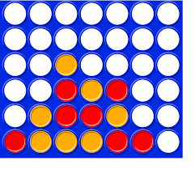

# 🎯 Puissance 4 (Connect Four) AI Project

This repository contains a Python implementation of the classic **Puissance 4** (Connect Four) game, complete with several AI opponents 🤖 (Random, Minimax, Alpha-Beta pruning, and versions using transposition tables). Players can face one of the built-in AI strategies to challenge the computer.

---

## 🧩 Game Board Preview

Below is a visual of the standard Puissance 4 board layout:



---

## 📝 Project Overview

Puissance 4 (Connect Four) is a two-player connection game in which players alternately drop colored discs into a seven-column, six-row vertically suspended grid. The pieces fall straight down, occupying the lowest available space within the column. The objective is to be the first to form a horizontal, vertical, or diagonal line of four of one’s own discs 🔴🟡.

In this implementation:
- 🧠 The board is represented internally as a one-dimensional list with border padding (to simplify move generation and win detection).
- 🤖 Multiple AI strategies are available:
  1. **Random AI**: Chooses a legal move at random.
  2. **Minimax (no transposition)**: Standard Minimax algorithm to a fixed depth.
  3. **Minimax with Transposition Table**: Same as Minimax, but caches previously evaluated positions for efficiency.
  4. **Alpha-Beta Pruning (no transposition)**: Minimax optimized with α-β pruning.
  5. **Alpha-Beta with Transposition Table**: Combines α-β pruning with a transposition table.
  6. **Monte Carlo Tree Search (MCTS)** : Soon. 

---

## ▶️ Run the Game

```bash 
python3 puissance_4.py 
```

---
> **Note**: This project was completed as part of a coursework assignment for a **Game Theory** course taught by **Didier Lime**.
